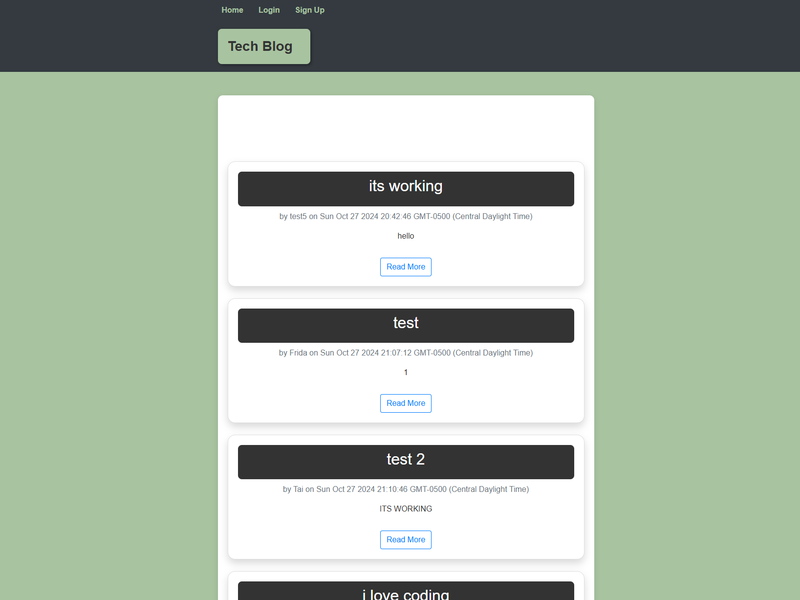
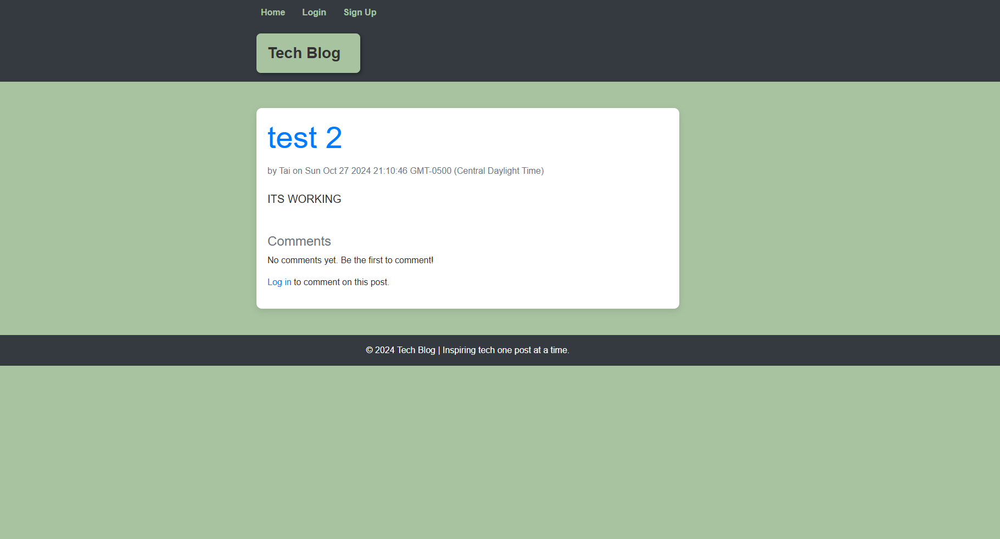

# Tech Blog

## Description

Tech Blog is a CMS-style application where developers can publish articles, blog posts, and comments, creating a dynamic and interactive tech community. The motivation behind building this project was to foster a platform where tech enthusiasts can easily share their knowledge and engage with others. This project was developed to demonstrate skills in the Model-View-Controller (MVC) architecture, session management, and RESTful API development. Key learning outcomes include understanding data handling with Sequelize, rendering views with Handlebars, and implementing user authentication and session storage.

## Table of Contents

- [Installation](#installation)
- [Usage](#usage)
- [Credits](#credits)
- [License](#license)
- [Badges](#badges)
- [Features](#features)
- [How to Contribute](#how-to-contribute)
- [Tests](#tests)

## Installation

To install and run the project locally:

1. Clone the repository:
    ```bash
    git clone <repository-url>
    ```
2. Navigate into the project folder:
    ```bash
    cd tech-blog
    ```
3. Install the dependencies:
    ```bash
    npm install
    ```
4. Set up the PostgreSQL database:
    - Create a PostgreSQL database named `tech_blog_db`.
    - Update the `.env` file with your PostgreSQL credentials (DB_NAME, DB_USER, DB_PASSWORD).
5. Run database migrations and seed data:
    ```bash
    npm run seed
    ```
6. Start the server:
    ```bash
    npm start
    ```
7. Open your browser and go to `http://localhost:3001` to view the app.

## Usage

To use Tech Blog:
1. Sign up or log in to create a personalized profile.
2. Create new blog posts, which are displayed on the homepage for others to see.
3. Interact with other posts by leaving comments.
4. Access your dashboard to view, edit, or delete your own posts.

### Screenshots




# Credits

This project was created by [Tai Ho](https://github.com/Justbeingtai/Tech-Blog.git).

Resources and third-party libraries used:
- [Sequelize ORM](https://sequelize.org/)
- [Express.js](https://expressjs.com/)
- [Handlebars.js](https://handlebarsjs.com/)
- [Bootstrap](https://getbootstrap.com/)

# License

This project is licensed under the MIT License. For more information, check the [Choose a License](https://choosealicense.com/) website.

# Badges


Badges provided by [Shields.io](https://shields.io/).

# Features

- User authentication with secure sessions
- Full CRUD functionality for blog posts
- User-friendly dashboard to manage posts
- Real-time commenting system
- Responsive design using Bootstrap for mobile-friendly access

# How to Contribute

To contribute to this project:

1. Fork the repository.
2. Create a feature branch:
    ```bash
    git checkout -b feature/YourFeature
    ```
3. Commit your changes:
    ```bash
    git commit -m 'Add new feature'
    ```
4. Push to your branch:
    ```bash
    git push origin feature/YourFeature
    ```
5. Open a pull request and describe your changes.

Refer to the [Contributor Covenant](https://www.contributor-covenant.org/) for contribution guidelines.

# Tests

To run tests:

1. Install testing dependencies:
    ```bash
    npm install --save-dev jest
    ```
2. Run tests:
    ```bash
    npm test
    ```

Add more tests as necessary to cover all features of the application.
